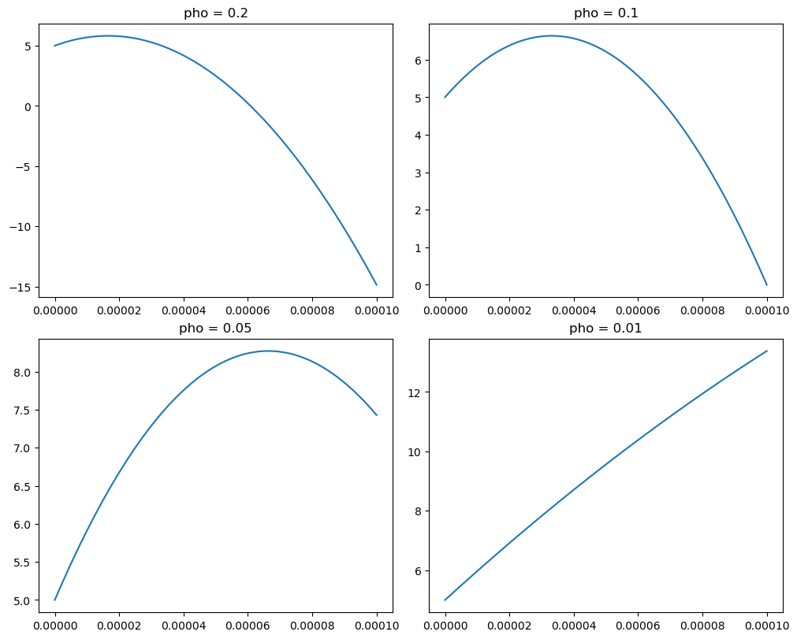

```python
import numpy as np
import matplotlib.pyplot as plt
import math
```


```python
# parameters for v(x) 
pho1 = 0.2         # volume charge density 
pho2 = 0.1
pho3 = 0.05
pho4 = 0.01
# if pho increases, shape is getting more sharp
er = 3.8        # SiO2 permittivity
e0 = 8.854e-12
e  = e0 * er 
distance = 100e-6 # distance between plates 
V_0 = 5 # 5 volts at x = 0
V_d = 0 # ground at x = distance
```


```python
C2 = 5
def potential_pho1(x, C1_pho1, C2):
    return -(pho1/(2*e))*(x**2) + C1_pho1*x + C2 
def potential_pho2(x, C1_pho2, C2):
    return -(pho2/(2*e))*(x**2) + C1_pho2*x + C2
def potential_pho3(x, C1_pho3, C2):
    return -(pho3/(2*e))*(x**2) + C1_pho3*x + C2
def potential_pho4(x, C1_pho4, C2):
    return -(pho4/(2*e))*(x**2) + C1_pho4*x + C2

# It would be more comfortable if using array
# for example, pho = [0.2, 0.1, 0.05, 0.01] and C1 = [ ~ ]
# Then make subplot using i, j as you can see below 

C1_pho1 = (pho1*distance)/(2*e) - (5/distance) # pho1,2,3,4 -> Fixing codes in a simpler way 
C1_pho2 = (pho2*distance)/(2*e) - (5/distance)
C1_pho3 = (pho3*distance)/(2*e) - (5/distance)
C1_pho4 = (pho4*distance)/(2*e) - (5/distance)
```


```python
x = np.linspace(0, distance, 500)
```


```python
# Making subplot for four values of rho 
figure, axis = plt.subplots(2, 2, figsize=(10, 8), constrained_layout=True)

# i, j = divmod(idx, 2)  # 2x2 subplot, calculate indexes

axis[0, 0].plot(x, potential_pho1(x, C1_pho1, C2))
axis[0, 0].set_title(f"pho = {pho1}")
axis[0, 0].set_xlabel("distance (m)")
axis[0, 1].plot(x, potential_pho2(x, C1_pho2, C2))
axis[0, 1].set_title(f"pho = {pho2}")
axis[0, 1].set_xlabel("distance (m)")
axis[1, 0].plot(x, potential_pho3(x, C1_pho3, C2))
axis[1, 0].set_title(f"pho = {pho3}")
axis[1, 0].set_xlabel("distance (m)")
axis[1, 1].plot(x, potential_pho4(x, C1_pho4, C2))
axis[1, 1].set_title(f"pho = {pho4}")
axis[1, 1].set_xlabel("distance (m)")

plt.show()
```


​    

​    


```python

```


```python

```
